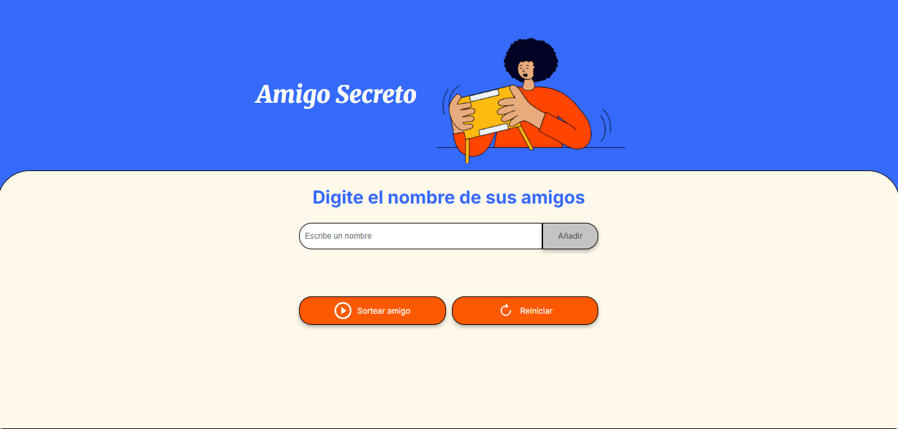
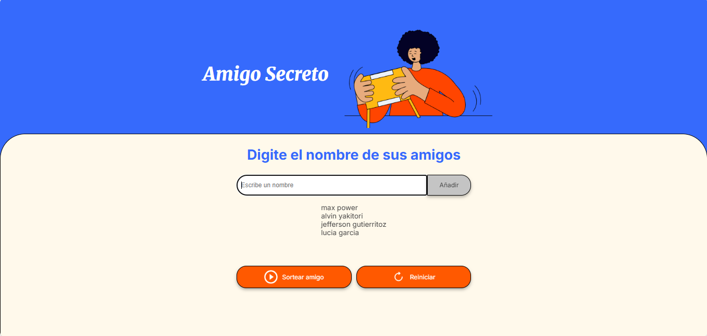
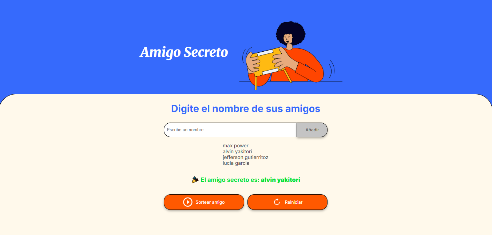

# 🎁 Amigo Secreto
Aplicación web sencilla para organizar un sorteo de **Amigo Secreto**.  
Permite a los usuarios ingresar nombres de amigos, listarlos y seleccionar uno al azar como el “amigo secreto”.

## 📌 Funcionalidades

- **Agregar nombres**  
  El usuario puede escribir el nombre de un amigo en el campo de texto y añadirlo a la lista con el botón `Añadir`.

- **Validar entradas**  
  No se permite agregar nombres vacíos. Se mostrará una alerta si se intenta.

- **Visualizar la lista**  
  Los nombres ingresados se muestran en una lista visible en la página.

- **Sortear amigo**  
  Al presionar el botón `Sortear Amigo`, la aplicación elige aleatoriamente un nombre y lo muestra en pantalla.

- **Reiniciar sorteo**  
  Botón adicional para limpiar la lista y el resultado, permitiendo iniciar un nuevo sorteo.

## 📸 Capturas de pantalla

### Pantalla principal

### Agregando nombres de  amigos

### Sorteo realizado

## 🎥 Video demostrativo
https://www.loom.com/share/46a9faef97694d26b15d403a5164808b

##🛠 Tecnologías utilizadas

HTML → estructura de la aplicación

CSS → estilos y diseño responsive

JavaScript → lógica de la aplicación

## Autor: Luis Felipe Caicedo Macias
